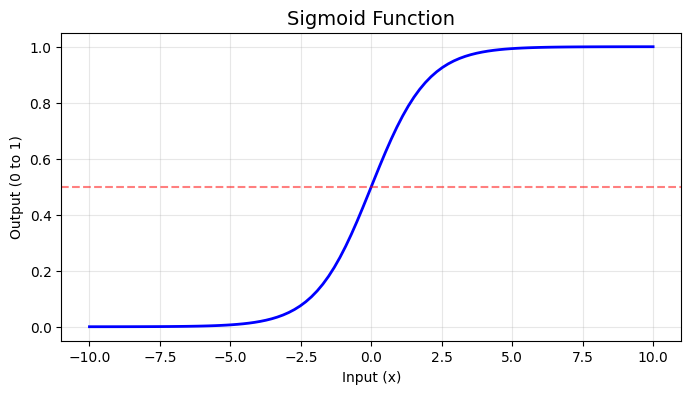

# Python Zero To Hero

## A comprehensive tutorial covering:
1. **Python Basics** - Variables, data types, I/O
2. **Data Structures** - Lists, tuples, dictionaries
3. **Functions and Classes** - Building blocks of code
4. **Neural Network from Scratch** - Understanding the fundamentals
5. **PyTorch Regression** - Predicting continuous values
6. **PyTorch Classification** - Predicting categories
7. **GPT from Scratch** - Building a language model

Written for beginners, with full explanations and docstrings!

## Part 0: Install Required Libraries

Run this cell first to install all necessary packages!


```python
# Install required packages (run this cell first!)
%pip install numpy pandas matplotlib torch scikit-learn
```

    Requirement already satisfied: numpy in ./venv/lib/python3.14/site-packages (2.4.1)
    Requirement already satisfied: pandas in ./venv/lib/python3.14/site-packages (2.3.3)
    Requirement already satisfied: matplotlib in ./venv/lib/python3.14/site-packages (3.10.8)
    Requirement already satisfied: torch in ./venv/lib/python3.14/site-packages (2.9.1)
    Requirement already satisfied: scikit-learn in ./venv/lib/python3.14/site-packages (1.8.0)
    Requirement already satisfied: python-dateutil>=2.8.2 in ./venv/lib/python3.14/site-packages (from pandas) (2.9.0.post0)
    Requirement already satisfied: pytz>=2020.1 in ./venv/lib/python3.14/site-packages (from pandas) (2025.2)
    Requirement already satisfied: tzdata>=2022.7 in ./venv/lib/python3.14/site-packages (from pandas) (2025.3)
    Requirement already satisfied: contourpy>=1.0.1 in ./venv/lib/python3.14/site-packages (from matplotlib) (1.3.3)
    Requirement already satisfied: cycler>=0.10 in ./venv/lib/python3.14/site-packages (from matplotlib) (0.12.1)
    Requirement already satisfied: fonttools>=4.22.0 in ./venv/lib/python3.14/site-packages (from matplotlib) (4.61.1)
    Requirement already satisfied: kiwisolver>=1.3.1 in ./venv/lib/python3.14/site-packages (from matplotlib) (1.4.9)
    Requirement already satisfied: packaging>=20.0 in ./venv/lib/python3.14/site-packages (from matplotlib) (25.0)
    Requirement already satisfied: pillow>=8 in ./venv/lib/python3.14/site-packages (from matplotlib) (12.1.0)
    Requirement already satisfied: pyparsing>=3 in ./venv/lib/python3.14/site-packages (from matplotlib) (3.3.1)
    Requirement already satisfied: filelock in ./venv/lib/python3.14/site-packages (from torch) (3.20.3)
    Requirement already satisfied: typing-extensions>=4.10.0 in ./venv/lib/python3.14/site-packages (from torch) (4.15.0)
    Requirement already satisfied: setuptools in ./venv/lib/python3.14/site-packages (from torch) (80.9.0)
    Requirement already satisfied: sympy>=1.13.3 in ./venv/lib/python3.14/site-packages (from torch) (1.14.0)
    Requirement already satisfied: networkx>=2.5.1 in ./venv/lib/python3.14/site-packages (from torch) (3.6.1)
    Requirement already satisfied: jinja2 in ./venv/lib/python3.14/site-packages (from torch) (3.1.6)
    Requirement already satisfied: fsspec>=0.8.5 in ./venv/lib/python3.14/site-packages (from torch) (2026.1.0)
    Requirement already satisfied: scipy>=1.10.0 in ./venv/lib/python3.14/site-packages (from scikit-learn) (1.17.0)
    Requirement already satisfied: joblib>=1.3.0 in ./venv/lib/python3.14/site-packages (from scikit-learn) (1.5.3)
    Requirement already satisfied: threadpoolctl>=3.2.0 in ./venv/lib/python3.14/site-packages (from scikit-learn) (3.6.0)
    Requirement already satisfied: six>=1.5 in ./venv/lib/python3.14/site-packages (from python-dateutil>=2.8.2->pandas) (1.17.0)
    Requirement already satisfied: mpmath<1.4,>=1.1.0 in ./venv/lib/python3.14/site-packages (from sympy>=1.13.3->torch) (1.3.0)
    Requirement already satisfied: MarkupSafe>=2.0 in ./venv/lib/python3.14/site-packages (from jinja2->torch) (3.0.3)
    Note: you may need to restart the kernel to use updated packages.


# Part 1: Python Basics 🎯

## 1.1 Input and Output (I/O)

**Output** = Computer talking TO you (`print()`)
**Input** = Computer listening FROM you (`input()`)


```python
# OUTPUT - Using print()
print("Hello, World!")
print("Welcome to Python!")

# Print multiple things
print("My favorite number is", 7)

# F-strings (formatted strings)
name = "Alex"
age = 14
print(f"My name is {name} and I am {age} years old.")
```

    Hello, World!
    Welcome to Python!
    My favorite number is 7
    My name is Alex and I am 14 years old.


```python
# INPUT - Getting info from user
# IMPORTANT: Enter a NUMBER when prompted!
user_name = input("What is your name? ")
print(f"Nice to meet you, {user_name}!")

age_string = input("How old are you? (enter a number) ")
age_number = int(age_string)
print(f"In 10 years, you'll be {age_number + 10} years old!")
```

    Nice to meet you, Cora!
    In 10 years, you'll be 27 years old!


## 1.2 Variables and Constants

**Variables** = Labeled boxes that CAN change
**Constants** = Values that should NOT change (ALL CAPS)


```python
# VARIABLES - Can change!
score = 0
print(f"Starting score: {score}")

score = score + 10
print(f"After bonus: {score}")

score += 5  # Shorthand
print(f"After another bonus: {score}")

# Different data types
player_name = "SuperCoder"  # String
health = 100                # Integer
speed = 5.5                 # Float
is_alive = True             # Boolean

print(f"\nPlayer: {player_name}, Health: {health}, Speed: {speed}, Alive: {is_alive}")
```

    Starting score: 0
    After bonus: 10
    After another bonus: 15
    
    Player: SuperCoder, Health: 100, Speed: 5.5, Alive: True


```python
# CONSTANTS - Should NOT change (ALL CAPS)
PI = 3.14159
GRAVITY = 9.8
MAX_PLAYERS = 10
GAME_TITLE = "Python Adventure"

print(f"PI = {PI}")
print(f"Gravity = {GRAVITY} m/s²")
print(f"Max Players = {MAX_PLAYERS}")

# Use constant in calculation
radius = 5
area = PI * radius * radius
print(f"\nCircle with radius {radius} has area {area:.2f}")
```

    PI = 3.14159
    Gravity = 9.8 m/s²
    Max Players = 10
    
    Circle with radius 5 has area 78.54


## 1.3 Data Types

| Type | Description | Example |
|------|-------------|---------|
| `int` | Whole numbers | `42`, `-7` |
| `float` | Decimals | `3.14`, `-0.5` |
| `str` | Text | `"Hello"` |
| `bool` | True/False | `True`, `False` |
| `None` | No value | `None` |


```python
# Exploring Data Types
my_int = 42
my_float = 3.14
my_string = "Hello Python!"
my_bool = True
my_none = None

# Use type() to check
print(f"{my_int} is type: {type(my_int)}")
print(f"{my_float} is type: {type(my_float)}")
print(f"{my_string} is type: {type(my_string)}")
print(f"{my_bool} is type: {type(my_bool)}")
print(f"{my_none} is type: {type(my_none)}")
```

    42 is type: <class 'int'>
    3.14 is type: <class 'float'>
    Hello Python! is type: <class 'str'>
    True is type: <class 'bool'>
    None is type: <class 'NoneType'>


```python
# Type Conversion (Casting)
text_number = "123"
real_number = int(text_number)
print(f"'{text_number}' + 1 = {real_number + 1}")

age = 14
age_text = str(age)
print(f"I am " + age_text + " years old")

price = 19.99
whole_price = int(price)  # Removes decimal
print(f"${price} rounded down is ${whole_price}")
```

    '123' + 1 = 124
    I am 14 years old
    $19.99 rounded down is $19


---
# Part 2: Data Structures 📦

## 2.1 Lists
An ordered collection you CAN modify. Like a shopping list!


```python
# Creating Lists
fruits = ["apple", "banana", "cherry"]
numbers = [1, 2, 3, 4, 5]
mixed = ["hello", 42, 3.14, True]

print("Fruits:", fruits)
print("Numbers:", numbers)

# Accessing by INDEX (starts at 0!)
print(f"\nFirst fruit: {fruits[0]}")
print(f"Last fruit: {fruits[-1]}")  # Negative = from end
```

    Fruits: ['apple', 'banana', 'cherry']
    Numbers: [1, 2, 3, 4, 5]
    
    First fruit: apple
    Last fruit: cherry


```python
# Modifying Lists
colors = ["red", "green", "blue"]
print("Original:", colors)

colors.append("yellow")      # Add to end
print("After append:", colors)

colors.insert(1, "orange")   # Insert at position
print("After insert:", colors)

colors.remove("green")       # Remove by value
print("After remove:", colors)

popped = colors.pop()        # Remove & return last
print(f"Popped: {popped}, Now: {colors}")

colors[0] = "purple"         # Change item
print("After change:", colors)

print(f"\nLength: {len(colors)}")
```

    Original: ['red', 'green', 'blue']
    After append: ['red', 'green', 'blue', 'yellow']
    After insert: ['red', 'orange', 'green', 'blue', 'yellow']
    After remove: ['red', 'orange', 'blue', 'yellow']
    Popped: yellow, Now: ['red', 'orange', 'blue']
    After change: ['purple', 'orange', 'blue']
    
    Length: 3


```python
# Looping through Lists
games = ["Minecraft", "Fortnite", "Roblox", "Among Us"]

print("My favorite games:")
for game in games:
    print(f"  - {game}")

# With index using enumerate()
print("\nWith rankings:")
for index, game in enumerate(games, start=1):
    print(f"  #{index}: {game}")

# Slicing
numbers = [0, 1, 2, 3, 4, 5, 6, 7, 8, 9]
print(f"\nFirst 3: {numbers[:3]}")
print(f"Last 3: {numbers[-3:]}")
print(f"Middle: {numbers[3:7]}")
```

    My favorite games:
      - Minecraft
      - Fortnite
      - Roblox
      - Among Us
    
    With rankings:
      #1: Minecraft
      #2: Fortnite
      #3: Roblox
      #4: Among Us
    
    First 3: [0, 1, 2]
    Last 3: [7, 8, 9]
    Middle: [3, 4, 5, 6]


## 2.2 Tuples
Like lists but CANNOT modify after creation. "Immutable". Good for coordinates, RGB colors.


```python
# Creating Tuples - use parentheses ()
coordinates = (10, 20)
rgb_red = (255, 0, 0)
person = ("Alice", 14, "9th Grade")

print(f"Coordinates: {coordinates}")
print(f"Red RGB: {rgb_red}")
print(f"Person: {person}")

# Accessing items
print(f"\nX: {coordinates[0]}, Y: {coordinates[1]}")

# Tuple unpacking
x, y = coordinates
name, age, grade = person
print(f"\nUnpacked: x={x}, y={y}")
print(f"{name} is {age} years old in {grade}")
```

    Coordinates: (10, 20)
    Red RGB: (255, 0, 0)
    Person: ('Alice', 14, '9th Grade')
    
    X: 10, Y: 20
    
    Unpacked: x=10, y=20
    Alice is 14 years old in 9th Grade


## 2.3 Dictionaries
Stores **key-value pairs**. Like a real dictionary: key = word, value = definition.


```python
# Creating Dictionaries - use curly braces {}
student = {
    "name": "Alex",
    "age": 14,
    "grade": 9,
    "gpa": 3.8
}

print("Student:", student)

# Accessing by KEY
print(f"\nName: {student['name']}")
print(f"GPA: {student['gpa']}")

# Using .get() is safer
print(f"Color: {student.get('color', 'Not specified')}")
```

    Student: {'name': 'Alex', 'age': 14, 'grade': 9, 'gpa': 3.8}
    
    Name: Alex
    GPA: 3.8
    Color: Not specified


```python
# Looping through Dictionaries
grades = {"Math": 95, "English": 88, "Science": 92, "History": 85}

print("Report Card:")
for subject, score in grades.items():
    status = "Pass" if score >= 60 else "Fail"
    print(f"  {subject}: {score} ({status})")

average = sum(grades.values()) / len(grades)
print(f"\nAverage: {average:.1f}")
```

    Report Card:
      Math: 95 (Pass)
      English: 88 (Pass)
      Science: 92 (Pass)
      History: 85 (Pass)
    
    Average: 90.0


---
# Part 3: Functions and Classes 🔧

## 3.1 Functions
A reusable block of code. Like a recipe: ingredients (parameters) → steps → dish (return value)


```python
def say_hello():
    """
    Print a simple greeting message to the console.
    
    This function demonstrates the most basic form of a Python function
    with no parameters and no return value.
    
    Parameters:
        None
    
    Returns:
        None: This function only prints output and returns nothing.
    
    Example:
        >>> say_hello()
        Hello, World!
    """
    print("Hello, World!")

# Call the function
say_hello()
say_hello()
```

    Hello, World!
    Hello, World!


```python
def greet(name):
    """
    Print a personalized greeting for a specific person.
    
    This function demonstrates a function with one parameter that
    customizes the output based on the input provided.
    
    Parameters:
        name (str): The name of the person to greet. This will be
            included in the greeting message displayed to the user.
    
    Returns:
        None: This function only prints output and returns nothing.
    
    Example:
        >>> greet("Alice")
        Hello, Alice! Nice to meet you!
    """
    print(f"Hello, {name}! Nice to meet you!")

greet("Alice")
greet("Bob")
```

    Hello, Alice! Nice to meet you!
    Hello, Bob! Nice to meet you!


```python
def add(a, b):
    """
    Add two numbers together and return the sum.
    
    This function demonstrates a function with multiple parameters
    and a return value that can be used in further calculations.
    
    Parameters:
        a (int or float): The first number to add. Can be any numeric type
            that supports the addition operation.
        b (int or float): The second number to add. Can be any numeric type
            that supports the addition operation.
    
    Returns:
        int or float: The sum of a and b. The return type matches the
            input types (int + int = int, float involved = float).
    
    Example:
        >>> result = add(5, 3)
        >>> print(result)
        8
    """
    result = a + b
    return result

sum_result = add(5, 3)
print(f"5 + 3 = {sum_result}")
```

    5 + 3 = 8


```python
def power(base, exponent=2):
    """
    Raise a base number to a given exponent power.
    
    This function demonstrates default parameter values. If no exponent
    is provided, it defaults to 2 (squaring the base).
    
    Parameters:
        base (int or float): The base number to be raised to a power.
            This is the number that will be multiplied by itself.
        exponent (int or float, optional): The power to raise the base to.
            Defaults to 2, which squares the number. Can be any numeric value.
    
    Returns:
        int or float: The result of base raised to the exponent power.
            Calculated as base ** exponent.
    
    Example:
        >>> power(3)       # 3 squared = 9
        9
        >>> power(2, 10)   # 2 to the 10th = 1024
        1024
    """
    return base ** exponent

print(f"3 squared: {power(3)}")
print(f"3 cubed: {power(3, 3)}")
print(f"2 to the 10th: {power(2, 10)}")
```

    3 squared: 9
    3 cubed: 27
    2 to the 10th: 1024


```python
def get_min_max(numbers):
    """
    Find and return both the minimum and maximum values in a list.
    
    This function demonstrates returning multiple values from a function
    using a tuple, which can then be unpacked by the caller.
    
    Parameters:
        numbers (list): A list of numeric values (int or float) to search
            through. The list must contain at least one element.
    
    Returns:
        tuple: A tuple containing two elements:
            - minimum_value: The smallest number in the list
            - maximum_value: The largest number in the list
    
    Example:
        >>> min_val, max_val = get_min_max([4, 1, 9, 2])
        >>> print(f"Min: {min_val}, Max: {max_val}")
        Min: 1, Max: 9
    """
    return min(numbers), max(numbers)

data = [4, 1, 9, 2, 7, 3]
minimum, maximum = get_min_max(data)
print(f"List: {data}")
print(f"Min: {minimum}, Max: {maximum}")
```

    List: [4, 1, 9, 2, 7, 3]
    Min: 1, Max: 9


## 3.2 Classes and Objects 🏗️

A **class** is a blueprint. An **object** is built from that blueprint.
- Class = Blueprint for a house
- Object = An actual house

Classes bundle **data** (attributes) and **behavior** (methods) together!


```python
class Dog:
    """
    A class representing a dog with attributes and behaviors.
    
    This class demonstrates object-oriented programming concepts including
    instance attributes, methods, and state management. Each Dog instance
    has its own name, breed, age, and energy level.
    
    Attributes:
        name (str): The dog's name, set during initialization.
        breed (str): The dog's breed (e.g., "Golden Retriever").
        age (int): The dog's age in years.
        energy (int): The dog's current energy level, ranging from 0 to 100.
            Starts at 100 and decreases when playing.
    
    Example:
        >>> my_dog = Dog("Buddy", "Golden Retriever", 3)
        >>> my_dog.bark()
        Buddy says: Woof! Woof!
        >>> my_dog.play()
        Buddy is playing! Energy: 80
    """
    
    def __init__(self, name, breed, age):
        """
        Initialize a new Dog instance with the given attributes.
        
        This is the constructor method that runs when a new Dog object
        is created. It sets up the initial state of the dog.
        
        Parameters:
            name (str): The dog's name.
            breed (str): The dog's breed.
            age (int): The dog's age in years.
        """
        self.name = name
        self.breed = breed
        self.age = age
        self.energy = 100
    
    def bark(self):
        """
        Make the dog bark by printing a bark message.
        
        This method simulates the dog barking by printing a message
        that includes the dog's name.
        
        Returns:
            None: Only prints output.
        """
        print(f"{self.name} says: Woof! Woof!")
    
    def play(self):
        """
        Make the dog play, consuming 20 energy points.
        
        If the dog has enough energy (>= 20), it plays and loses 20 energy.
        If the dog is too tired (energy < 20), it refuses to play.
        
        Returns:
            None: Only prints output and modifies energy.
        """
        if self.energy >= 20:
            self.energy -= 20
            print(f"{self.name} is playing! Energy: {self.energy}")
        else:
            print(f"{self.name} is too tired to play!")
    
    def sleep(self):
        """
        Restore the dog's energy to full (100 points).
        
        This method simulates the dog sleeping and recovering all
        of its energy back to the maximum of 100.
        
        Returns:
            None: Only prints output and modifies energy.
        """
        self.energy = 100
        print(f"{self.name} slept and recovered energy!")
    
    def info(self):
        """
        Display the dog's information.
        
        Prints a formatted string showing the dog's name, breed, and age.
        
        Returns:
            None: Only prints output.
        """
        print(f"Name: {self.name}, Breed: {self.breed}, Age: {self.age}")

# Create objects
dog1 = Dog("Buddy", "Golden Retriever", 3)
dog2 = Dog("Max", "German Shepherd", 5)

print("=== Dog 1 ===")
dog1.info()
dog1.bark()
dog1.play()

print("\n=== Dog 2 ===")
dog2.info()
dog2.bark()
```

    === Dog 1 ===
    Name: Buddy, Breed: Golden Retriever, Age: 3
    Buddy says: Woof! Woof!
    Buddy is playing! Energy: 80
    
    === Dog 2 ===
    Name: Max, Breed: German Shepherd, Age: 5
    Max says: Woof! Woof!


```python
class BankAccount:
    """
    A class representing a simple bank account with deposit/withdraw operations.
    
    This class demonstrates encapsulation by managing account balance and
    transaction history. It includes validation to prevent invalid operations
    like withdrawing more than the available balance.
    
    Attributes:
        owner (str): The name of the account owner.
        balance (float): Current account balance in dollars.
        transactions (list): History of all transactions as formatted strings.
    
    Example:
        >>> account = BankAccount("Alex", 100)
        >>> account.deposit(50)
        Deposited $50. New balance: $150
        >>> account.withdraw(30)
        Withdrew $30. New balance: $120
    """
    
    def __init__(self, owner, initial_balance=0):
        """
        Initialize a new bank account.
        
        Creates a new account with the specified owner and optional
        starting balance. Also initializes an empty transaction history.
        
        Parameters:
            owner (str): The name of the account owner.
            initial_balance (float, optional): Starting balance. Defaults to 0.
        """
        self.owner = owner
        self.balance = initial_balance
        self.transactions = []
    
    def deposit(self, amount):
        """
        Add money to the account.
        
        Validates that the deposit amount is positive before adding
        to the balance and recording the transaction.
        
        Parameters:
            amount (float): The amount to deposit. Must be positive.
        
        Returns:
            None: Prints confirmation or error message.
        """
        if amount > 0:
            self.balance += amount
            self.transactions.append(f"+${amount}")
            print(f"Deposited ${amount}. New balance: ${self.balance}")
        else:
            print("Deposit amount must be positive!")
    
    def withdraw(self, amount):
        """
        Remove money from the account.
        
        Validates that the withdrawal amount is positive and doesn't
        exceed the current balance before processing.
        
        Parameters:
            amount (float): The amount to withdraw. Must be positive
                and not exceed the current balance.
        
        Returns:
            None: Prints confirmation or error message.
        """
        if amount > self.balance:
            print(f"Insufficient funds! Balance: ${self.balance}")
        elif amount <= 0:
            print("Withdrawal amount must be positive!")
        else:
            self.balance -= amount
            self.transactions.append(f"-${amount}")
            print(f"Withdrew ${amount}. New balance: ${self.balance}")
    
    def get_balance(self):
        """
        Return the current account balance.
        
        Returns:
            float: The current balance in the account.
        """
        return self.balance
    
    def show_history(self):
        """
        Display all transaction history and current balance.
        
        Prints a formatted list of all deposits and withdrawals,
        followed by the current account balance.
        
        Returns:
            None: Only prints output.
        """
        print(f"\n{self.owner}'s Transaction History:")
        for t in self.transactions:
            print(f"  {t}")
        print(f"Current Balance: ${self.balance}")

# Test the BankAccount
account = BankAccount("Alex", 100)
account.deposit(50)
account.withdraw(30)
account.withdraw(200)  # Should fail
account.deposit(100)
account.show_history()
```

    Deposited $50. New balance: $150
    Withdrew $30. New balance: $120
    Insufficient funds! Balance: $120
    Deposited $100. New balance: $220
    
    Alex's Transaction History:
      +$50
      -$30
      +$100
    Current Balance: $220


---
# Part 4: Neural Network from Scratch! 🧠

## How Neural Networks Learn:
1. **Forward Pass** - Data goes through, makes predictions
2. **Loss Calculation** - Measure how wrong we are
3. **Backward Pass (Backpropagation)** - Calculate how to fix weights
4. **Optimization** - Actually update the weights


```python
import numpy as np
import matplotlib.pyplot as plt

np.random.seed(42)
print("NumPy ready! Let's build a neural network!")
```

    NumPy ready! Let's build a neural network!


```python
def sigmoid(x):
    """
    Sigmoid activation function that squishes any number to range (0, 1).
    
    The sigmoid function is one of the most common activation functions
    in neural networks. It's especially useful for binary classification
    because it outputs values that can be interpreted as probabilities.
    
    Parameters:
        x (numpy.ndarray or float): Input value(s) to apply sigmoid to.
            Can be a single number or an array of any shape.
    
    Returns:
        numpy.ndarray or float: Output value(s) in the range (0, 1).
            Large positive inputs close to 1
            Large negative inputs close to 0
            Zero exactly 0.5
    
    Formula:
        sigmoid(x) = 1 / (1 + e^(-x))
    
    Example:
        >>> sigmoid(0)
        0.5
        >>> sigmoid(10)
        0.9999546...
    """
    return 1 / (1 + np.exp(-x))


def sigmoid_derivative(x):
    """
    Compute the derivative of the sigmoid function.
    
    This derivative is essential for backpropagation, as it tells us
    how much the sigmoid output changes when the input changes.
    The derivative has a nice property: it can be computed from
    the sigmoid output itself.
    
    Parameters:
        x (numpy.ndarray or float): Input value(s) to compute derivative at.
    
    Returns:
        numpy.ndarray or float: The gradient/derivative of sigmoid at x.
            Maximum value of 0.25 occurs at x=0.
    
    Formula:
        sigmoid_derivative(x) = sigmoid(x) * (1 - sigmoid(x))
    
    Note:
        Used in backpropagation to calculate gradients for weight updates.
    """
    s = sigmoid(x)
    return s * (1 - s)


# Visualize
x = np.linspace(-10, 10, 100)
y = sigmoid(x)

plt.figure(figsize=(8, 4))
plt.plot(x, y, 'b-', linewidth=2)
plt.title('Sigmoid Function', fontsize=14)
plt.xlabel('Input (x)')
plt.ylabel('Output (0 to 1)')
plt.grid(True, alpha=0.3)
plt.axhline(y=0.5, color='r', linestyle='--', alpha=0.5)
plt.show()

print("Sigmoid examples:")
print(f"sigmoid(-10) = {sigmoid(-10):.6f}  (near 0)")
print(f"sigmoid(0)   = {sigmoid(0):.6f}  (exactly 0.5)")
print(f"sigmoid(10)  = {sigmoid(10):.6f}  (near 1)")
```


    

    


    Sigmoid examples:
    sigmoid(-10) = 0.000045  (near 0)
    sigmoid(0)   = 0.500000  (exactly 0.5)
    sigmoid(10)  = 0.999955  (near 1)


## The XOR Problem

| Input A | Input B | Output |
|---------|---------|--------|
| 0 | 0 | 0 |
| 0 | 1 | 1 |
| 1 | 0 | 1 |
| 1 | 1 | 0 |

Output is 1 when inputs are DIFFERENT, 0 when SAME.


```python
# XOR Dataset
X = np.array([[0, 0], [0, 1], [1, 0], [1, 1]])
y = np.array([[0], [1], [1], [0]])

print("XOR Dataset:")
for i in range(len(X)):
    print(f"Input: {X[i]} → Output: {y[i][0]}")

# Initialize Network
np.random.seed(42)
W1 = np.random.randn(2, 4) * 0.5
b1 = np.zeros((1, 4))
W2 = np.random.randn(4, 1) * 0.5
b2 = np.zeros((1, 1))
print(f"\nNetwork: 2 inputs → 4 hidden → 1 output")
```

    XOR Dataset:
    Input: [0 0] → Output: 0
    Input: [0 1] → Output: 1
    Input: [1 0] → Output: 1
    Input: [1 1] → Output: 0
    
    Network: 2 inputs → 4 hidden → 1 output


```python
def forward(X, W1, b1, W2, b2):
    """
    Perform forward pass through a 2-layer neural network.
    
    The forward pass computes predictions by passing input data through
    the network layers. Each layer applies a linear transformation
    (weights * inputs + bias) followed by the sigmoid activation function.
    
    Parameters:
        X (numpy.ndarray): Input data of shape (num_samples, num_features).
            Each row is one sample, each column is one feature.
        W1 (numpy.ndarray): Weights for layer 1, shape (num_features, num_hidden).
            Transforms input features to hidden layer neurons.
        b1 (numpy.ndarray): Bias for layer 1, shape (1, num_hidden).
            Added to each hidden neuron's computation.
        W2 (numpy.ndarray): Weights for layer 2, shape (num_hidden, num_output).
            Transforms hidden neurons to output.
        b2 (numpy.ndarray): Bias for layer 2, shape (1, num_output).
            Added to each output neuron's computation.
    
    Returns:
        tuple: A tuple containing:
            - a2 (numpy.ndarray): Output predictions, shape (num_samples, num_output).
            - cache (dict): Dictionary containing intermediate values needed for
              backpropagation: 'z1', 'a1', 'z2', 'a2'.
    
    Process:
        1. z1 = X @ W1 + b1  (linear transformation)
        2. a1 = sigmoid(z1)  (activation)
        3. z2 = a1 @ W2 + b2 (linear transformation)
        4. a2 = sigmoid(z2)  (activation/output)
    """
    z1 = np.dot(X, W1) + b1
    a1 = sigmoid(z1)
    z2 = np.dot(a1, W2) + b2
    a2 = sigmoid(z2)
    cache = {'z1': z1, 'a1': a1, 'z2': z2, 'a2': a2}
    return a2, cache


def mse_loss(y_true, y_pred):
    """
    Calculate Mean Squared Error loss between true and predicted values.
    
    MSE is one of the most common loss functions for regression problems.
    It measures the average squared difference between predictions and
    actual values, penalizing larger errors more heavily.
    
    Parameters:
        y_true (numpy.ndarray): True target values (ground truth).
        y_pred (numpy.ndarray): Predicted values from the model.
    
    Returns:
        float: The mean squared error, always non-negative.
            Lower values indicate better predictions.
    
    Formula:
        MSE = (1/n) * sum((y_true - y_pred)^2)
    """
    return np.mean((y_true - y_pred) ** 2)


# Test forward pass BEFORE training
predictions, cache = forward(X, W1, b1, W2, b2)
print("BEFORE Training:")
for i in range(len(X)):
    print(f"Input: {X[i]} -> Pred: {predictions[i][0]:.4f} | Expected: {y[i][0]}")
print(f"\nLoss: {mse_loss(y, predictions):.4f}")
```

    BEFORE Training:
    Input: [0 0] -> Pred: 0.4467 | Expected: 0
    Input: [0 1] -> Pred: 0.4303 | Expected: 1
    Input: [1 0] -> Pred: 0.4270 | Expected: 1
    Input: [1 1] -> Pred: 0.4126 | Expected: 0
    
    Loss: 0.2557


```python
def backward(X, y, cache, W2):
    """
    Perform backward pass (backpropagation) to calculate gradients.
    
    Backpropagation computes how much each weight contributed to the error,
    allowing us to update weights in the direction that reduces error.
    Uses the chain rule to propagate gradients from output to input.
    
    Parameters:
        X (numpy.ndarray): Input data used in forward pass.
        y (numpy.ndarray): True target labels.
        cache (dict): Dictionary containing forward pass intermediate values:
            - 'z1': Pre-activation values for hidden layer
            - 'a1': Post-activation values for hidden layer
            - 'z2': Pre-activation values for output layer
            - 'a2': Post-activation values (predictions)
        W2 (numpy.ndarray): Weights for layer 2, needed for gradient computation.
    
    Returns:
        dict: Dictionary containing gradients for all parameters:
            - 'dW1': Gradient for W1, shape matches W1
            - 'db1': Gradient for b1, shape matches b1
            - 'dW2': Gradient for W2, shape matches W2
            - 'db2': Gradient for b2, shape matches b2
    
    Process:
        1. Compute output layer error: dz2 = a2 - y
        2. Compute W2 gradient: dW2 = a1.T @ dz2 / m
        3. Propagate error to hidden layer: da1 = dz2 @ W2.T
        4. Compute hidden layer error: dz1 = da1 * sigmoid'(z1)
        5. Compute W1 gradient: dW1 = X.T @ dz1 / m
    """
    m = X.shape[0]
    a1, a2, z1 = cache['a1'], cache['a2'], cache['z1']
    
    # Output layer gradients
    dz2 = a2 - y
    dW2 = np.dot(a1.T, dz2) / m
    db2 = np.sum(dz2, axis=0, keepdims=True) / m
    
    # Hidden layer gradients
    da1 = np.dot(dz2, W2.T)
    dz1 = da1 * sigmoid_derivative(z1)
    dW1 = np.dot(X.T, dz1) / m
    db1 = np.sum(dz1, axis=0, keepdims=True) / m
    
    return {'dW1': dW1, 'db1': db1, 'dW2': dW2, 'db2': db2}


def update_weights(W1, b1, W2, b2, grads, learning_rate):
    """
    Update neural network weights using gradient descent.
    
    Gradient descent moves each weight in the opposite direction of its
    gradient, scaled by the learning rate. This reduces the loss over time.
    
    Parameters:
        W1 (numpy.ndarray): Current weights for layer 1.
        b1 (numpy.ndarray): Current bias for layer 1.
        W2 (numpy.ndarray): Current weights for layer 2.
        b2 (numpy.ndarray): Current bias for layer 2.
        grads (dict): Dictionary containing gradients from backward pass.
        learning_rate (float): Step size for weight updates. Larger values
            mean bigger steps but may overshoot; smaller values are more
            stable but slower.
    
    Returns:
        tuple: Updated parameters (W1, b1, W2, b2) after gradient descent step.
    
    Formula:
        W_new = W_old - learning_rate * gradient
    """
    W1 = W1 - learning_rate * grads['dW1']
    b1 = b1 - learning_rate * grads['db1']
    W2 = W2 - learning_rate * grads['dW2']
    b2 = b2 - learning_rate * grads['db2']
    return W1, b1, W2, b2

print("Backward pass and update functions ready!")
```

    Backward pass and update functions ready!


```python
def train_network(X, y, epochs=10000, learning_rate=2.0):
    """
    Train a 2-layer neural network from scratch using gradient descent.
    
    This function implements the complete training loop: forward pass to make
    predictions, loss calculation, backward pass to compute gradients, and
    weight updates to improve the model.
    
    Parameters:
        X (numpy.ndarray): Input features of shape (num_samples, num_features).
        y (numpy.ndarray): Target labels of shape (num_samples, num_outputs).
        epochs (int, optional): Number of complete passes through the training
            data. More epochs = more learning but also more time. Defaults to 10000.
        learning_rate (float, optional): Step size for gradient descent updates.
            Controls how much weights change each iteration. Defaults to 2.0.
    
    Returns:
        tuple: A tuple containing:
            - W1 (numpy.ndarray): Trained weights for layer 1.
            - b1 (numpy.ndarray): Trained bias for layer 1.
            - W2 (numpy.ndarray): Trained weights for layer 2.
            - b2 (numpy.ndarray): Trained bias for layer 2.
            - losses (list): Loss value at each epoch for visualization.
    
    Training Loop:
        For each epoch:
        1. Forward pass: Compute predictions
        2. Calculate loss: Measure prediction error
        3. Backward pass: Compute gradients
        4. Update weights: Apply gradient descent
    """
    np.random.seed(42)
    W1 = np.random.randn(2, 4) * 0.5
    b1 = np.zeros((1, 4))
    W2 = np.random.randn(4, 1) * 0.5
    b2 = np.zeros((1, 1))
    losses = []
    
    print("🚀 Training Started!")
    for epoch in range(epochs):
        preds, cache = forward(X, W1, b1, W2, b2)
        loss = mse_loss(y, preds)
        losses.append(loss)
        grads = backward(X, y, cache, W2)
        W1, b1, W2, b2 = update_weights(W1, b1, W2, b2, grads, learning_rate)
        
        if epoch % 2000 == 0:
            print(f"Epoch {epoch:5d} | Loss: {loss:.6f}")
    
    print("✅ Training Complete!")
    return W1, b1, W2, b2, losses

W1_t, b1_t, W2_t, b2_t, loss_history = train_network(X, y)
```

    🚀 Training Started!
    Epoch     0 | Loss: 0.255675
    Epoch  2000 | Loss: 0.000005
    Epoch  4000 | Loss: 0.000001
    Epoch  6000 | Loss: 0.000000
    Epoch  8000 | Loss: 0.000000
    ✅ Training Complete!


```python
# Test trained network
print("🎯 AFTER Training:")
final_preds, _ = forward(X, W1_t, b1_t, W2_t, b2_t)

for i in range(len(X)):
    pred = final_preds[i][0]
    expected = y[i][0]
    rounded = round(pred)
    status = "✅" if rounded == expected else "❌"
    print(f"Input: {X[i]} → Pred: {pred:.4f} (≈{rounded}) | Expected: {expected} {status}")

accuracy = np.mean(np.round(final_preds) == y) * 100
print(f"\n🎉 Accuracy: {accuracy:.0f}%")
```

    🎯 AFTER Training:
    Input: [0 0] → Pred: 0.0005 (≈0) | Expected: 0 ✅
    Input: [0 1] → Pred: 0.9997 (≈1) | Expected: 1 ✅
    Input: [1 0] → Pred: 0.9997 (≈1) | Expected: 1 ✅
    Input: [1 1] → Pred: 0.0003 (≈0) | Expected: 0 ✅
    
    🎉 Accuracy: 100%


```python
# Save the neural network
import pickle

nn_model = {'W1': W1_t, 'b1': b1_t, 'W2': W2_t, 'b2': b2_t}

with open('scratch_neural_network.pkl', 'wb') as f:
    pickle.dump(nn_model, f)
print("💾 Model saved to 'scratch_neural_network.pkl'")

# Load and verify
with open('scratch_neural_network.pkl', 'rb') as f:
    loaded_nn = pickle.load(f)
print("📂 Model loaded successfully!")
```

    💾 Model saved to 'scratch_neural_network.pkl'
    📂 Model loaded successfully!


---
# Part 5: PyTorch Regression Model 📈

**Regression** predicts a continuous number (like price, temperature, score).


```python
import torch
import torch.nn as nn
import torch.optim as optim
import pandas as pd
from sklearn.model_selection import train_test_split
from sklearn.preprocessing import StandardScaler

print(f"PyTorch version: {torch.__version__}")
```

    PyTorch version: 2.9.1


```python
# Create Housing Data CSV
np.random.seed(42)
n_samples = 1000

square_feet = np.random.randint(500, 4000, n_samples)
bedrooms = np.random.randint(1, 6, n_samples)
bathrooms = np.random.randint(1, 4, n_samples)
age = np.random.randint(0, 50, n_samples)
price = (square_feet * 150 + bedrooms * 15000 + bathrooms * 10000 +
         (50 - age) * 1000 + np.random.randn(n_samples) * 20000)

housing_df = pd.DataFrame({
    'square_feet': square_feet, 'bedrooms': bedrooms,
    'bathrooms': bathrooms, 'age': age, 'price': price
})
housing_df.to_csv('housing_data.csv', index=False)
print("📊 Created 'housing_data.csv'")
print(housing_df.head())
```

    📊 Created 'housing_data.csv'
       square_feet  bedrooms  bathrooms  age          price
    0         3674         2          1   27  617629.746207
    1         1360         1          2   42  248646.597734
    2         1794         2          1   40  332280.626977
    3         1630         1          1   38  275989.794191
    4         1595         4          2   21  366530.439184


```python
# Prepare data for PyTorch
df = pd.read_csv('housing_data.csv')
X_data = df[['square_feet', 'bedrooms', 'bathrooms', 'age']].values
y_data = df['price'].values.reshape(-1, 1)

X_train, X_test, y_train, y_test = train_test_split(X_data, y_data, test_size=0.2, random_state=42)

scaler_X = StandardScaler()
scaler_y = StandardScaler()
X_train_s = scaler_X.fit_transform(X_train)
X_test_s = scaler_X.transform(X_test)
y_train_s = scaler_y.fit_transform(y_train)
y_test_s = scaler_y.transform(y_test)

X_train_t = torch.FloatTensor(X_train_s)
y_train_t = torch.FloatTensor(y_train_s)
X_test_t = torch.FloatTensor(X_test_s)
y_test_t = torch.FloatTensor(y_test_s)

print(f"Training: {len(X_train)} | Testing: {len(X_test)}")
```

    Training: 800 | Testing: 200


```python
class HousePricePredictor(nn.Module):
    """
    A neural network model for predicting house prices.
    
    This class demonstrates how to create a PyTorch neural network for
    regression tasks. It uses three fully connected layers with ReLU
    activation functions to learn the relationship between house features
    and prices.
    
    Architecture:
        Input (4 features) → Linear(64) → ReLU → Linear(32) → ReLU → Linear(1)
    
    Attributes:
        layer1 (nn.Linear): First fully connected layer transforming 4 inputs to 64 neurons.
        layer2 (nn.Linear): Second fully connected layer transforming 64 to 32 neurons.
        layer3 (nn.Linear): Output layer transforming 32 neurons to 1 price prediction.
        relu (nn.ReLU): ReLU activation function applied between layers.
    
    Example:
        >>> model = HousePricePredictor(input_size=4)
        >>> features = torch.tensor([[2000, 3, 2, 10]], dtype=torch.float32)
        >>> predicted_price = model(features)
    """
    
    def __init__(self, input_size):
        """
        Initialize the HousePricePredictor model.
        
        Creates the neural network architecture with three linear layers
        and ReLU activation. The network progressively reduces dimensionality
        from input_size → 64 → 32 → 1.
        
        Parameters:
            input_size (int): Number of input features. For housing data,
                this is typically 4 (square_feet, bedrooms, bathrooms, age).
        """
        super(HousePricePredictor, self).__init__()
        self.layer1 = nn.Linear(input_size, 64)
        self.layer2 = nn.Linear(64, 32)
        self.layer3 = nn.Linear(32, 1)
        self.relu = nn.ReLU()
    
    def forward(self, x):
        """
        Perform forward pass through the network.
        
        Takes input features and passes them through the network layers
        to produce a price prediction. ReLU activation is applied after
        the first two layers but not the output layer.
        
        Parameters:
            x (torch.Tensor): Input tensor of shape (batch_size, input_size)
                containing the house features.
        
        Returns:
            torch.Tensor: Predicted house prices of shape (batch_size, 1).
                Note: Output is scaled if input was scaled.
        """
        x = self.relu(self.layer1(x))
        x = self.relu(self.layer2(x))
        return self.layer3(x)

model = HousePricePredictor(input_size=4)
print("🏠 House Price Predictor:")
print(model)
```

    🏠 House Price Predictor:
    HousePricePredictor(
      (layer1): Linear(in_features=4, out_features=64, bias=True)
      (layer2): Linear(in_features=64, out_features=32, bias=True)
      (layer3): Linear(in_features=32, out_features=1, bias=True)
      (relu): ReLU()
    )


```python
# Train the regression model
criterion = nn.MSELoss()
optimizer = optim.Adam(model.parameters(), lr=0.01)

print("🚀 Training...")
for epoch in range(500):
    model.train()
    preds = model(X_train_t)
    loss = criterion(preds, y_train_t)
    
    optimizer.zero_grad()
    loss.backward()
    optimizer.step()
    
    if (epoch + 1) % 100 == 0:
        print(f"Epoch {epoch+1:3d} | Loss: {loss.item():.6f}")

print("✅ Training Complete!")
```

    🚀 Training...
    Epoch 100 | Loss: 0.014738
    Epoch 200 | Loss: 0.013461
    Epoch 300 | Loss: 0.012802
    Epoch 400 | Loss: 0.012176
    Epoch 500 | Loss: 0.011676
    ✅ Training Complete!


```python
# Evaluate regression model
model.eval()
with torch.no_grad():
    test_preds = model(X_test_t)

pred_prices = scaler_y.inverse_transform(test_preds.numpy())
actual_prices = scaler_y.inverse_transform(y_test_s)

mae = np.mean(np.abs(pred_prices - actual_prices))
print(f"Mean Absolute Error: ${mae:,.0f}")

print("\n🏠 Sample Predictions:")
for i in range(5):
    print(f"Predicted: ${pred_prices[i][0]:>10,.0f} | Actual: ${actual_prices[i][0]:>10,.0f}")
```

    Mean Absolute Error: $18,075
    
    🏠 Sample Predictions:
    Predicted: $   596,514 | Actual: $   625,896
    Predicted: $   637,994 | Actual: $   641,823
    Predicted: $   622,952 | Actual: $   579,123
    Predicted: $   626,620 | Actual: $   656,709
    Predicted: $   394,016 | Actual: $   347,727


```python
# Save regression model
torch.save({
    'model_state_dict': model.state_dict(),
    'scaler_X': scaler_X,
    'scaler_y': scaler_y,
}, 'house_price_model.pth')
print("💾 Model saved to 'house_price_model.pth'")

# Load and test
loaded = torch.load('house_price_model.pth', weights_only=False)
loaded_model = HousePricePredictor(input_size=4)
loaded_model.load_state_dict(loaded['model_state_dict'])
loaded_model.eval()

# Predict new house
new_house = np.array([[2000, 3, 2, 10]])
new_scaled = loaded['scaler_X'].transform(new_house)
with torch.no_grad():
    pred = loaded_model(torch.FloatTensor(new_scaled))
    price = loaded['scaler_y'].inverse_transform(pred.numpy())

print(f"\n🏠 New Prediction: 2000 sqft, 3 bed, 2 bath, 10 yrs = ${price[0][0]:,.0f}")
```

    💾 Model saved to 'house_price_model.pth'
    
    🏠 New Prediction: 2000 sqft, 3 bed, 2 bath, 10 yrs = $415,521


---
# Part 6: PyTorch Classification Model 🏷️

**Classification** predicts a category (like pass/fail, cat/dog, spam/not spam).


```python
# Create Student Data CSV
np.random.seed(42)
n = 1000

study_hours = np.random.uniform(0, 10, n)
attendance = np.random.uniform(50, 100, n)
prev_grade = np.random.uniform(40, 100, n)
sleep_hours = np.random.uniform(4, 10, n)

score = (study_hours * 8 + attendance * 0.5 + prev_grade * 0.3 +
         sleep_hours * 3 + np.random.randn(n) * 10)
passed = (score > np.median(score)).astype(int)

student_df = pd.DataFrame({
    'study_hours': study_hours, 'attendance': attendance,
    'prev_grade': prev_grade, 'sleep_hours': sleep_hours, 'passed': passed
})
student_df.to_csv('student_data.csv', index=False)
print("📊 Created 'student_data.csv'")
print(f"Passed: {passed.sum()} | Failed: {n - passed.sum()}")
```

    📊 Created 'student_data.csv'
    Passed: 500 | Failed: 500


```python
# Prepare classification data
df_c = pd.read_csv('student_data.csv')
X_c = df_c[['study_hours', 'attendance', 'prev_grade', 'sleep_hours']].values
y_c = df_c['passed'].values

X_train_c, X_test_c, y_train_c, y_test_c = train_test_split(X_c, y_c, test_size=0.2, random_state=42)

scaler_c = StandardScaler()
X_train_cs = scaler_c.fit_transform(X_train_c)
X_test_cs = scaler_c.transform(X_test_c)

X_train_ct = torch.FloatTensor(X_train_cs)
y_train_ct = torch.FloatTensor(y_train_c).unsqueeze(1)
X_test_ct = torch.FloatTensor(X_test_cs)
y_test_ct = torch.FloatTensor(y_test_c).unsqueeze(1)

print(f"Training: {len(X_train_c)} | Testing: {len(X_test_c)}")
```

    Training: 800 | Testing: 200


```python
class StudentClassifier(nn.Module):
    """
    A neural network binary classifier for predicting student pass/fail.
    
    This class demonstrates a classification model in PyTorch. Unlike regression,
    the output uses a sigmoid activation to produce a probability between 0 and 1,
    which represents the likelihood of passing.
    
    Architecture:
        Input (4 features) → Linear(32) → ReLU → Linear(16) → ReLU → Linear(1) → Sigmoid
    
    Attributes:
        layer1 (nn.Linear): First fully connected layer, 4 inputs to 32 neurons.
        layer2 (nn.Linear): Second fully connected layer, 32 to 16 neurons.
        layer3 (nn.Linear): Output layer, 16 neurons to 1 output.
        relu (nn.ReLU): ReLU activation for hidden layers.
        sigmoid (nn.Sigmoid): Sigmoid activation for output probability.
    
    Example:
        >>> classifier = StudentClassifier(input_size=4)
        >>> features = torch.tensor([[6, 85, 75, 7]], dtype=torch.float32)
        >>> pass_probability = classifier(features)
    """
    
    def __init__(self, input_size):
        """
        Initialize the StudentClassifier model.
        
        Creates the neural network with three linear layers, ReLU activations
        for hidden layers, and sigmoid activation for the output to produce
        a probability between 0 and 1.
        
        Parameters:
            input_size (int): Number of input features. For student data,
                this is typically 4 (study_hours, attendance, prev_grade, sleep_hours).
        """
        super(StudentClassifier, self).__init__()
        self.layer1 = nn.Linear(input_size, 32)
        self.layer2 = nn.Linear(32, 16)
        self.layer3 = nn.Linear(16, 1)
        self.relu = nn.ReLU()
        self.sigmoid = nn.Sigmoid()
    
    def forward(self, x):
        """
        Perform forward pass through the classifier network.
        
        Passes input through hidden layers with ReLU activation, then
        applies sigmoid to the output to produce a probability.
        
        Parameters:
            x (torch.Tensor): Input tensor of shape (batch_size, input_size)
                containing the student features.
        
        Returns:
            torch.Tensor: Probability of passing, shape (batch_size, 1),
                with values between 0 and 1. Values > 0.5 typically
                indicate a "pass" prediction.
        """
        x = self.relu(self.layer1(x))
        x = self.relu(self.layer2(x))
        return self.sigmoid(self.layer3(x))

classifier = StudentClassifier(input_size=4)
print("🎓 Student Classifier:")
print(classifier)
```

    🎓 Student Classifier:
    StudentClassifier(
      (layer1): Linear(in_features=4, out_features=32, bias=True)
      (layer2): Linear(in_features=32, out_features=16, bias=True)
      (layer3): Linear(in_features=16, out_features=1, bias=True)
      (relu): ReLU()
      (sigmoid): Sigmoid()
    )


```python
# Train classifier
criterion_c = nn.BCELoss()
optimizer_c = optim.Adam(classifier.parameters(), lr=0.01)

print("🚀 Training...")
for epoch in range(300):
    classifier.train()
    preds = classifier(X_train_ct)
    loss = criterion_c(preds, y_train_ct)
    
    optimizer_c.zero_grad()
    loss.backward()
    optimizer_c.step()
    
    if (epoch + 1) % 60 == 0:
        acc = ((preds > 0.5).float() == y_train_ct).float().mean()
        print(f"Epoch {epoch+1:3d} | Loss: {loss.item():.4f} | Acc: {acc.item()*100:.1f}%")

print("✅ Training Complete!")
```

    🚀 Training...
    Epoch  60 | Loss: 0.2003 | Acc: 90.6%
    Epoch 120 | Loss: 0.1762 | Acc: 91.6%
    Epoch 180 | Loss: 0.1529 | Acc: 92.6%
    Epoch 240 | Loss: 0.1310 | Acc: 93.5%
    Epoch 300 | Loss: 0.1168 | Acc: 94.6%
    ✅ Training Complete!


```python
# Evaluate classifier
classifier.eval()
with torch.no_grad():
    test_preds = classifier(X_test_ct)
    test_labels = (test_preds > 0.5).float()
    acc = (test_labels == y_test_ct).float().mean()

print(f"📊 Test Accuracy: {acc.item()*100:.1f}%")
```

    📊 Test Accuracy: 86.5%


```python
# Save classifier
torch.save({
    'model_state_dict': classifier.state_dict(),
    'scaler': scaler_c
}, 'student_classifier.pth')
print("💾 Model saved to 'student_classifier.pth'")

# Load and predict
loaded_c = torch.load('student_classifier.pth', weights_only=False)
loaded_clf = StudentClassifier(input_size=4)
loaded_clf.load_state_dict(loaded_c['model_state_dict'])
loaded_clf.eval()

new_student = np.array([[6, 85, 75, 7]])
new_s = loaded_c['scaler'].transform(new_student)
with torch.no_grad():
    prob = loaded_clf(torch.FloatTensor(new_s))

print(f"\n🎓 Student (6hrs study, 85% attend, 75 prev, 7hrs sleep)")
print(f"Pass Probability: {prob.item()*100:.1f}%")
print(f"Prediction: {'PASS ✅' if prob.item() > 0.5 else 'FAIL ❌'}")
```

    💾 Model saved to 'student_classifier.pth'
    
    🎓 Student (6hrs study, 85% attend, 75 prev, 7hrs sleep)
    Pass Probability: 94.5%
    Prediction: PASS ✅


---
# Part 7: GPT from Scratch! 🤖

Building a mini GPT (Generative Pre-trained Transformer)!

GPT uses:
- **Tokenization** - Converting text to numbers
- **Embeddings** - Giving meaning to tokens
- **Self-Attention** - Understanding context
- **Transformer** - The architecture powering modern AI!


```python
# Training text for GPT
text = """
The quick brown fox jumps over the lazy dog.
Python is a great programming language for beginners.
Machine learning helps computers learn from data.
Neural networks are inspired by the human brain.
Deep learning uses many layers of neurons.
Artificial intelligence is transforming our world.
Data science combines statistics and programming.
The future of technology is exciting and full of possibilities.
Learning to code opens many doors for young people.
Practice makes perfect when learning new skills.
"""

print(f"Training text: {len(text)} characters")
```

    Training text: 508 characters


```python
# Tokenization with UNK token for unknown characters
chars = sorted(list(set(text)))
chars = ['<UNK>'] + chars  # Add unknown token at index 0
vocab_size = len(chars)

char_to_idx = {ch: i for i, ch in enumerate(chars)}
idx_to_char = {i: ch for i, ch in enumerate(chars)}


def encode(s):
    """
    Convert a string to a list of integer token indices.
    
    This function tokenizes text at the character level, mapping each
    character to its corresponding integer index. Unknown characters
    (not in the vocabulary) are mapped to index 0 (the <UNK> token).
    
    Parameters:
        s (str): The input string to encode/tokenize.
    
    Returns:
        list: A list of integer indices representing each character.
            Each index corresponds to a position in the vocabulary.
    
    Example:
        >>> encode("hi")
        [23, 24]  # Indices depend on vocabulary
    """
    return [char_to_idx.get(c, 0) for c in s]


def decode(indices):
    """
    Convert a list of integer token indices back to a string.
    
    This function reverses the tokenization process, mapping each
    integer index back to its corresponding character.
    
    Parameters:
        indices (list): A list of integer indices to decode.
    
    Returns:
        str: The decoded string reconstructed from the indices.
    
    Example:
        >>> decode([23, 24])
        "hi"
    """
    return ''.join([idx_to_char[i] for i in indices])


print(f"Vocabulary size: {vocab_size}")
print(f"Example: 'learn' → {encode('learn')} → '{decode(encode('learn'))}'")
```

    Vocabulary size: 37
    Example: 'learn' → [22, 15, 11, 28, 24] → 'learn'


```python
# GPT Hyperparameters
block_size = 32       # Context window size
batch_size = 16       # Number of sequences per batch
embed_size = 64       # Embedding dimension
n_heads = 4           # Number of attention heads
n_layers = 2          # Number of transformer blocks
learning_rate = 1e-3  # Learning rate for optimizer

data = torch.tensor(encode(text), dtype=torch.long)


def get_batch():
    """
    Generate a random batch of training sequences for the GPT model.
    
    Creates input-target pairs where the target is the input shifted
    by one position. This teaches the model to predict the next character.
    
    Parameters:
        None (uses global data, block_size, batch_size variables)
    
    Returns:
        tuple: A tuple containing:
            - x (torch.Tensor): Input sequences of shape (batch_size, block_size)
            - y (torch.Tensor): Target sequences of shape (batch_size, block_size)
              where y[i] = x[i] shifted right by 1 position
    
    Example:
        If x = "The quick", then y = "he quick " (next char for each position)
    """
    ix = torch.randint(len(data) - block_size, (batch_size,))
    x = torch.stack([data[i:i+block_size] for i in ix])
    y = torch.stack([data[i+1:i+block_size+1] for i in ix])
    return x, y


xb, yb = get_batch()
print(f"Batch shapes: x={xb.shape}, y={yb.shape}")
print(f"Learning rate: {learning_rate}")
```

    Batch shapes: x=torch.Size([16, 32]), y=torch.Size([16, 32])
    Learning rate: 0.001


```python
class Head(nn.Module):
    """
    A single head of self-attention for the transformer.
    
    Self-attention allows each position in a sequence to attend to all
    previous positions, learning which parts of the context are relevant
    for predicting the next token. This implements scaled dot-product attention.
    
    Attributes:
        key (nn.Linear): Linear projection for computing keys.
        query (nn.Linear): Linear projection for computing queries.
        value (nn.Linear): Linear projection for computing values.
        tril (torch.Tensor): Lower triangular mask for causal attention.
    
    Example:
        >>> head = Head(head_size=16)
        >>> x = torch.randn(2, 32, 64)  # (batch, seq_len, embed_size)
        >>> output = head(x)  # (batch, seq_len, head_size)
    """
    
    def __init__(self, head_size):
        """
        Initialize a single attention head.
        
        Creates the key, query, and value projection layers and registers
        the causal mask as a buffer (not a parameter).
        
        Parameters:
            head_size (int): The dimension of the key/query/value projections.
                Typically embed_size // n_heads.
        """
        super().__init__()
        self.key = nn.Linear(embed_size, head_size, bias=False)
        self.query = nn.Linear(embed_size, head_size, bias=False)
        self.value = nn.Linear(embed_size, head_size, bias=False)
        self.register_buffer('tril', torch.tril(torch.ones(block_size, block_size)))
    
    def forward(self, x):
        """
        Apply scaled dot-product self-attention to the input.
        
        Computes attention weights between all positions, applies causal
        masking to prevent attending to future positions, and returns
        the weighted sum of values.
        
        Parameters:
            x (torch.Tensor): Input tensor of shape (batch, seq_len, embed_size).
        
        Returns:
            torch.Tensor: Output tensor of shape (batch, seq_len, head_size)
                after applying self-attention.
        
        Process:
            1. Project input to keys, queries, values
            2. Compute attention scores: Q @ K^T / sqrt(d_k)
            3. Apply causal mask (prevent attending to future)
            4. Softmax to get attention weights
            5. Weighted sum of values
        """
        B, T, C = x.shape
        k = self.key(x)
        q = self.query(x)
        
        weights = q @ k.transpose(-2, -1) * (C ** -0.5)
        weights = weights.masked_fill(self.tril[:T, :T] == 0, float('-inf'))
        weights = torch.softmax(weights, dim=-1)
        
        v = self.value(x)
        return weights @ v

print("✅ Head class defined!")
```

    ✅ Head class defined!


```python
class MultiHeadAttention(nn.Module):
    """
    Multi-head self-attention mechanism for the transformer.
    
    Runs multiple attention heads in parallel and concatenates their outputs.
    This allows the model to jointly attend to information from different
    representation subspaces at different positions.
    
    Attributes:
        heads (nn.ModuleList): List of Head modules running in parallel.
        proj (nn.Linear): Output projection to combine head outputs.
    
    Example:
        >>> mha = MultiHeadAttention(num_heads=4, head_size=16)
        >>> x = torch.randn(2, 32, 64)
        >>> output = mha(x)  # (2, 32, 64)
    """
    
    def __init__(self, num_heads, head_size):
        """
        Initialize multi-head attention with the specified number of heads.
        
        Creates multiple attention heads and an output projection layer
        to combine their outputs back to the embedding dimension.
        
        Parameters:
            num_heads (int): Number of parallel attention heads.
            head_size (int): Dimension of each attention head.
                num_heads * head_size should equal embed_size.
        """
        super().__init__()
        self.heads = nn.ModuleList([Head(head_size) for _ in range(num_heads)])
        self.proj = nn.Linear(embed_size, embed_size)
    
    def forward(self, x):
        """
        Apply multi-head attention to the input.
        
        Runs all attention heads in parallel, concatenates their outputs,
        and projects back to the embedding dimension.
        
        Parameters:
            x (torch.Tensor): Input tensor of shape (batch, seq_len, embed_size).
        
        Returns:
            torch.Tensor: Output tensor of shape (batch, seq_len, embed_size)
                after multi-head attention and output projection.
        """
        out = torch.cat([h(x) for h in self.heads], dim=-1)
        return self.proj(out)

print("✅ MultiHeadAttention class defined!")
```

    ✅ MultiHeadAttention class defined!


```python
class FeedForward(nn.Module):
    """
    Position-wise feed-forward network for the transformer.
    
    A simple two-layer neural network applied independently to each position.
    This is the "feed-forward" part of the transformer block that processes
    each position's representation after the attention step.
    
    Architecture:
        Linear(embed_size → 4*embed_size) → ReLU → Linear(4*embed_size → embed_size)
    
    Attributes:
        net (nn.Sequential): The feed-forward network layers.
    
    Example:
        >>> ffn = FeedForward(embed_size=64)
        >>> x = torch.randn(2, 32, 64)
        >>> output = ffn(x)  # (2, 32, 64)
    """
    
    def __init__(self, embed_size):
        """
        Initialize the feed-forward network.
        
        Creates a two-layer MLP with an expansion factor of 4 in the hidden
        layer, which is standard in transformer architectures.
        
        Parameters:
            embed_size (int): The embedding dimension (input and output size).
        """
        super().__init__()
        self.net = nn.Sequential(
            nn.Linear(embed_size, 4 * embed_size),
            nn.ReLU(),
            nn.Linear(4 * embed_size, embed_size),
        )
    
    def forward(self, x):
        """
        Apply the feed-forward network to the input.
        
        Processes each position independently through the two-layer MLP.
        
        Parameters:
            x (torch.Tensor): Input tensor of shape (batch, seq_len, embed_size).
        
        Returns:
            torch.Tensor: Output tensor of same shape after feed-forward processing.
        """
        return self.net(x)

print("✅ FeedForward class defined!")
```

    ✅ FeedForward class defined!


```python
class TransformerBlock(nn.Module):
    """
    A single transformer block with self-attention and feed-forward layers.
    
    This block implements the standard transformer architecture with pre-norm
    layer normalization, multi-head self-attention with residual connection,
    and a feed-forward network with residual connection.
    
    Architecture:
        x → LayerNorm → MultiHeadAttention → + x → LayerNorm → FeedForward → + x
    
    Attributes:
        attention (MultiHeadAttention): The multi-head attention layer.
        ffn (FeedForward): The position-wise feed-forward network.
        ln1 (nn.LayerNorm): Layer normalization before attention.
        ln2 (nn.LayerNorm): Layer normalization before feed-forward.
    
    Example:
        >>> block = TransformerBlock(embed_size=64, n_heads=4)
        >>> x = torch.randn(2, 32, 64)
        >>> output = block(x)  # (2, 32, 64)
    """
    
    def __init__(self, embed_size, n_heads):
        """
        Initialize the transformer block.
        
        Creates the multi-head attention, feed-forward network, and
        layer normalization components.
        
        Parameters:
            embed_size (int): The embedding dimension.
            n_heads (int): Number of attention heads. embed_size must be
                divisible by n_heads.
        """
        super().__init__()
        head_size = embed_size // n_heads
        self.attention = MultiHeadAttention(n_heads, head_size)
        self.ffn = FeedForward(embed_size)
        self.ln1 = nn.LayerNorm(embed_size)
        self.ln2 = nn.LayerNorm(embed_size)
    
    def forward(self, x):
        """
        Apply the transformer block to the input.
        
        Applies layer norm, attention with residual, then layer norm
        and feed-forward with residual.
        
        Parameters:
            x (torch.Tensor): Input tensor of shape (batch, seq_len, embed_size).
        
        Returns:
            torch.Tensor: Output tensor of same shape after transformer processing.
        """
        x = x + self.attention(self.ln1(x))
        x = x + self.ffn(self.ln2(x))
        return x

print("✅ TransformerBlock class defined!")
```

    ✅ TransformerBlock class defined!


```python
class MiniGPT(nn.Module):
    """
    A small GPT model for character-level text generation.
    
    This implements a decoder-only transformer that learns to predict
    the next character given a sequence of previous characters. It uses
    token embeddings, positional embeddings, transformer blocks, and
    a final linear layer to produce logits over the vocabulary.
    
    Architecture:
        Token Embedding + Position Embedding → N × TransformerBlock → LayerNorm → Linear
    
    Attributes:
        token_embedding (nn.Embedding): Embedding layer for input tokens.
        position_embedding (nn.Embedding): Embedding layer for position indices.
        blocks (nn.Sequential): Stack of transformer blocks.
        ln_final (nn.LayerNorm): Final layer normalization.
        output (nn.Linear): Output projection to vocabulary logits.
    
    Example:
        >>> gpt = MiniGPT()
        >>> x = torch.tensor([[1, 2, 3, 4]])
        >>> logits, loss = gpt(x, targets=torch.tensor([[2, 3, 4, 5]]))
    """
    
    def __init__(self):
        """
        Initialize the MiniGPT model.
        
        Creates token embeddings, positional embeddings, transformer blocks,
        final layer norm, and output projection. Uses global hyperparameters
        vocab_size, embed_size, block_size, n_heads, and n_layers.
        """
        super().__init__()
        self.token_embedding = nn.Embedding(vocab_size, embed_size)
        self.position_embedding = nn.Embedding(block_size, embed_size)
        self.blocks = nn.Sequential(*[
            TransformerBlock(embed_size, n_heads) for _ in range(n_layers)
        ])
        self.ln_final = nn.LayerNorm(embed_size)
        self.output = nn.Linear(embed_size, vocab_size)
    
    def forward(self, idx, targets=None):
        """
        Perform forward pass through the GPT model.
        
        Computes token and position embeddings, passes through transformer
        blocks, and produces logits. Optionally computes cross-entropy loss.
        
        Parameters:
            idx (torch.Tensor): Input token indices of shape (batch, seq_len).
            targets (torch.Tensor, optional): Target token indices for computing
                loss, same shape as idx but shifted by one position.
        
        Returns:
            tuple: A tuple containing:
                - logits (torch.Tensor): Output logits of shape (batch, seq_len, vocab_size)
                - loss (torch.Tensor or None): Cross-entropy loss if targets provided
        """
        B, T = idx.shape
        tok_emb = self.token_embedding(idx)
        pos_emb = self.position_embedding(torch.arange(T))
        x = tok_emb + pos_emb
        x = self.blocks(x)
        x = self.ln_final(x)
        logits = self.output(x)
        
        loss = None
        if targets is not None:
            B, T, C = logits.shape
            logits_flat = logits.view(B*T, C)
            targets_flat = targets.view(B*T)
            loss = torch.nn.functional.cross_entropy(logits_flat, targets_flat)
        
        return logits, loss
    
    def generate(self, idx, max_new_tokens):
        """
        Generate new tokens autoregressively.
        
        Starting from the given context, generates new tokens one at a time
        by sampling from the model's output distribution.
        
        Parameters:
            idx (torch.Tensor): Starting context of shape (batch, seq_len).
            max_new_tokens (int): Number of new tokens to generate.
        
        Returns:
            torch.Tensor: Extended sequence of shape (batch, seq_len + max_new_tokens).
        """
        for _ in range(max_new_tokens):
            idx_cond = idx[:, -block_size:]
            logits, _ = self(idx_cond)
            logits = logits[:, -1, :]
            probs = torch.softmax(logits, dim=-1)
            idx_next = torch.multinomial(probs, num_samples=1)
            idx = torch.cat((idx, idx_next), dim=1)
        return idx

gpt = MiniGPT()
print(f"🤖 Mini GPT Created! Parameters: {sum(p.numel() for p in gpt.parameters()):,}")
```

    🤖 Mini GPT Created! Parameters: 106,533


### Training the GPT

Now let's train our GPT to learn the patterns in the text!


```python
# Training loop for GPT
optimizer = torch.optim.AdamW(gpt.parameters(), lr=learning_rate)

print("🏋️ Training Mini GPT...")
print("-" * 40)

for step in range(2000):
    # Get a batch of data
    xb, yb = get_batch()
    
    # Forward pass and compute loss
    logits, loss = gpt(xb, yb)
    
    # Backward pass
    optimizer.zero_grad()
    loss.backward()
    optimizer.step()
    
    # Print progress every 200 steps
    if step % 200 == 0:
        print(f"Step {step:4d} | Loss: {loss.item():.4f}")

print("-" * 40)
print(f"✅ Training complete! Final loss: {loss.item():.4f}")
```

    🏋️ Training Mini GPT...
    ----------------------------------------
    Step    0 | Loss: 3.8210
    Step  200 | Loss: 1.5639
    Step  400 | Loss: 0.4786
    Step  600 | Loss: 0.1955
    Step  800 | Loss: 0.1388
    Step 1000 | Loss: 0.1291
    Step 1200 | Loss: 0.1284
    Step 1400 | Loss: 0.1342
    Step 1600 | Loss: 0.1308
    Step 1800 | Loss: 0.1186
    ----------------------------------------
    ✅ Training complete! Final loss: 0.1134


### Generate Text with GPT

Let's use our trained model to generate new text!


```python
def generate_text(prompt, max_tokens=100):
    """
    Generate text from a prompt using the trained GPT model.
    
    Takes a text prompt, encodes it, feeds it to the model,
    and decodes the generated tokens back to text.
    
    Parameters:
        prompt (str): The starting text to generate from.
        max_tokens (int): Maximum number of new tokens to generate.
            Default is 100.
    
    Returns:
        str: The generated text including the original prompt.
    
    Example:
        >>> generate_text("Machine learning is", max_tokens=50)
        'Machine learning is the study of algorithms...'
    """
    # Encode the prompt
    context = torch.tensor([encode(prompt)])
    
    # Generate tokens
    generated = gpt.generate(context, max_new_tokens=max_tokens)
    
    # Decode and return
    return decode(generated[0].tolist())

# Test generation with different prompts
print("📝 Generating text from prompts:")
print("=" * 50)

prompts = ["Machine", "Python", "Data"]

for prompt in prompts:
    print(f"\n🔹 Prompt: '{prompt}'")
    print("-" * 40)
    generated = generate_text(prompt, max_tokens=80)
    print(generated)
    print()
```

    📝 Generating text from prompts:
    ==================================================
    
    🔹 Prompt: 'Machine'
    ----------------------------------------
    Machine learning helps computers learn from data.
    Neural networks are inspired by the h
    
    
    🔹 Prompt: 'Python'
    ----------------------------------------
    Python is a great programming langre furebe of technology is exciting and full of poss
    
    
    🔹 Prompt: 'Data'
    ----------------------------------------
    Data science combines statistics and programming.
    The future of technology is exciti
    


### Save and Load GPT Model

Let's save our trained GPT and demonstrate loading it back!


```python
# Save the GPT model
torch.save({
    'model_state_dict': gpt.state_dict(),
    'vocab_size': vocab_size,
    'embed_size': embed_size,
    'block_size': block_size,
    'n_heads': n_heads,
    'n_layers': n_layers,
    'char_to_idx': char_to_idx,
    'idx_to_char': idx_to_char
}, 'mini_gpt_model.pth')

print("💾 GPT model saved to 'mini_gpt_model.pth'!")

# Load the model to verify
checkpoint = torch.load('mini_gpt_model.pth')

loaded_gpt = MiniGPT()
loaded_gpt.load_state_dict(checkpoint['model_state_dict'])
loaded_gpt.eval()

print("✅ GPT model loaded successfully!")

# Test the loaded model
print("\n📝 Testing loaded model:")
test_prompt = "Machine"
context = torch.tensor([encode(test_prompt)])
generated = loaded_gpt.generate(context, max_new_tokens=32)
print(f"Prompt: '{test_prompt}'")
print(f"Generated: {decode(generated[0].tolist())}")
```

    💾 GPT model saved to 'mini_gpt_model.pth'!
    ✅ GPT model loaded successfully!
    
    📝 Testing loaded model:
    Prompt: 'Machine'
    Generated: Machine learning helps computers learn 


---

# 🎉 Congratulations! You've Completed the Full Mini-Course!

## What You Learned:

### Part 1: Python Basics
- Input/Output with `print()` and `input()`
- Variables and data types (int, float, str, bool)
- Constants (naming convention)

### Part 2: Data Structures
- **Lists**: Ordered, mutable collections `[1, 2, 3]`
- **Tuples**: Ordered, immutable collections `(1, 2, 3)`
- **Dictionaries**: Key-value pairs `{"key": "value"}`

### Part 3: Functions and Classes
- Functions with parameters, returns, and docstrings
- Classes with `__init__`, methods, and attributes
- Object-oriented programming basics

### Part 4: Neural Network from Scratch
- Sigmoid activation function
- Forward propagation
- Mean Squared Error loss
- Backpropagation and gradient descent
- Training loop

### Part 5: PyTorch Regression
- Loading data with pandas
- Feature scaling with StandardScaler
- Building a regression model with nn.Module
- Training and making predictions

### Part 6: PyTorch Classification
- Binary classification problem
- Sigmoid output for probabilities
- BCELoss for binary cross-entropy
- Accuracy calculation

### Part 7: GPT from Scratch
- Character-level tokenization with UNK token
- Self-attention mechanism
- Multi-head attention
- Transformer blocks
- Text generation

## Files Created:
- `housing_data.csv` - Sample housing data
- `student_data.csv` - Sample student data
- `scratch_neural_network.pkl` - Neural network from scratch
- `house_price_model.pth` - PyTorch regression model
- `student_classifier.pth` - PyTorch classification model
- `mini_gpt_model.pth` - Mini GPT model

## Next Steps:
1. 📚 Read more about neural networks and deep learning
2. 🔬 Experiment with different hyperparameters
3. 📊 Try training on your own datasets
4. 🚀 Explore more advanced architectures (CNNs, RNNs, Transformers)
5. 🤗 Check out Hugging Face for pre-trained models

**Great job on completing this comprehensive guide!** 🌟
